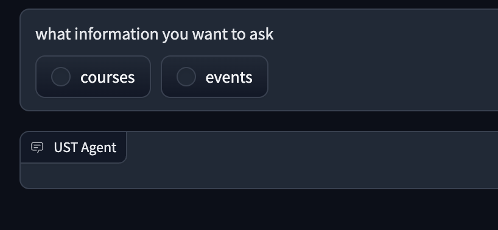
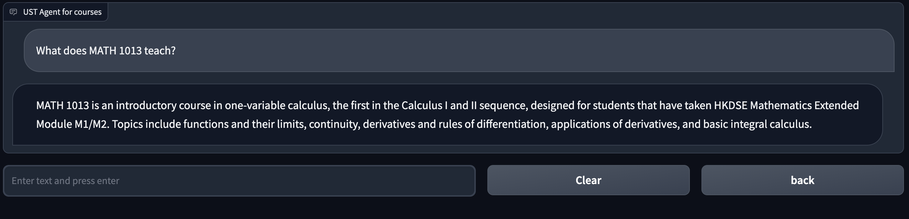
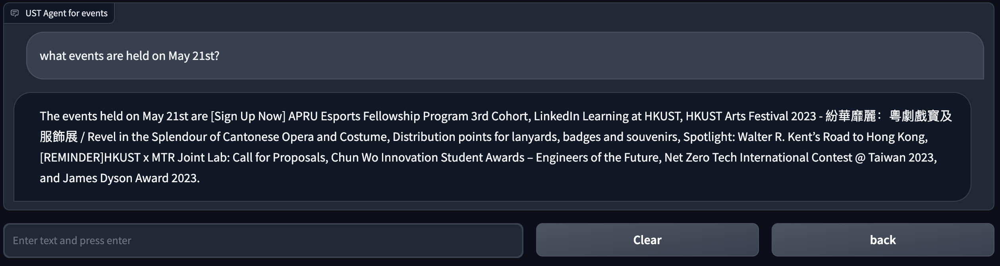

# USTAgent

**UST agent can answer the questions related to the information of the course and daily events in HKUST.**

## Introduction
The required packages are listed in requirements.txt. To install the required packages, please run the following command in the terminal:

```bash
pip install -r requirements.txt
```

**To start running**, please run the following command in the terminal. You need to type in your OpenAI API key as indicated.

```bash
python main.py --key=YOUR_OpenAI_API_KEY
```

## Basic Functions

After running the code, the agent will provide a link to the local host at the terminal. You can click the link to start chatting with the agent.

At the beginning, the agent will ask you to choose the function you want to use. You can choose from asking courses or events.



### 1. Course Information

After selecting the ***courses*** option, you may ask for information about courses:



### 2. Event Inforamtion

After selecting the ***events*** option, you may ask for information about events:



Feel free to ask the agent any questions about the courses or events in HKUST!
